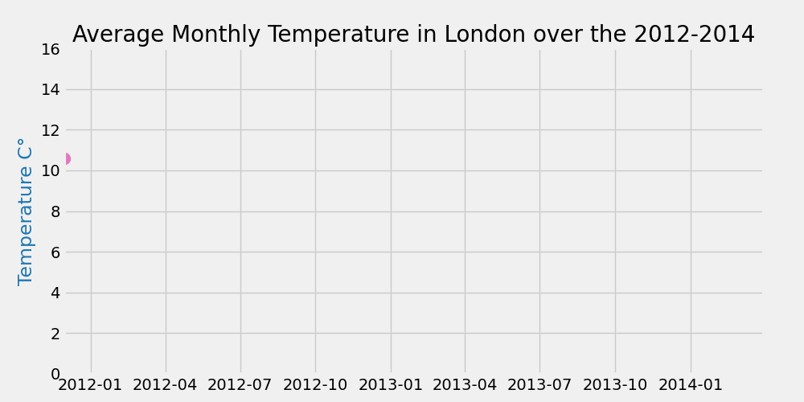

# Beautiful GIF(s) in Python for Data Analysis

In this project, I am going to create some interesting animations using an interresting library.
Here, Animations are particularly useful when analysing time-series data. This helps us get better understandings of the trends, seasonalities on how particular features behave over the span of the time series data.

## Data
I am using the data from Kaggle: <a href="https://www.kaggle.com/jeanmidev/smart-meters-in-london" target="blank_">source</a>. The time-series data recordings representing the weather parameters of the city of London going from the span of 2011 to 2014.

## Visualizing by animation
<ol>
  <li>
    The average temperature of the city
    
  </li>
  <li>
    Adding some colour sections into the Animation
    
  </li>
  <li>
    Subplot Animation
    
  </li>
</ol>

